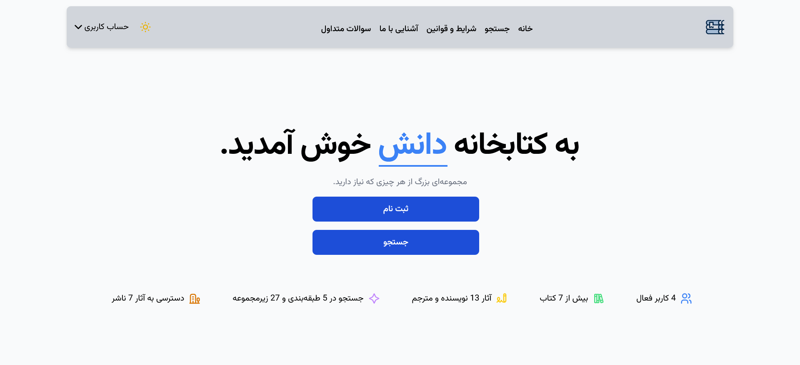
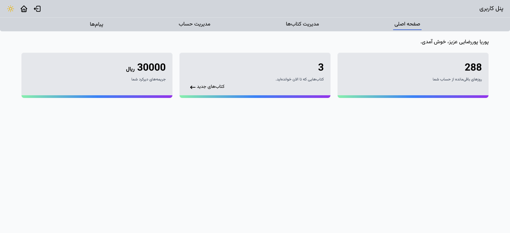
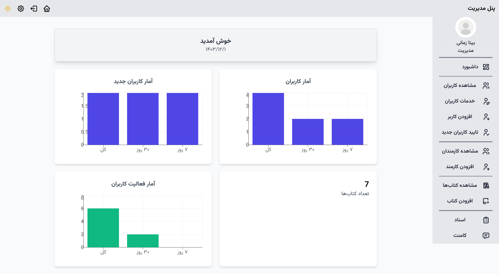

# Library Management System

## Overview

The **Library Management System** is a modern web-based application designed to facilitate book management, borrowing, and returning operations. Built with **React (Vite)** for the frontend, **Supabase** for database and authentication, and **Express.js** for backend operations, it provides an efficient and seamless user experience.

## Features

- **Book Management**: Add, update, and remove books from the collection.
- **User Authentication**: Secure login and registration via Supabase Auth.
- **Borrow & Return Books**: Track borrowed books and return history.
- **Analytics Dashboard**: Graphs and insights powered by Recharts.
- **Search & Filter**: Easily find books based on different criteria.
- **Secure API**: Uses Express and Supabase for data handling.

## 🖼️ Screenshots

Here are some screenshots of the **Library Management System** in action:


_The homepage._


_showing the book collection and search functionality._


_User panel page for managing your own data._


_Admin panel page for managing users and books data._

## Tech Stack

- **Frontend**: React (Vite), Tailwind CSS
- **Backend**: Express.js, Supabase
- **State Management**: Context API / Hooks
- **Styling**: Tailwind CSS
- **Data Visualization**: Recharts
- **API Calls**: Axios

## Installation & Setup

### Clone the Repository

```sh
git clone https://github.com/BitaZamani/library-management.git
cd library-management
```

### Install Dependencies

#### Frontend:

```sh
npm install
```

#### Backend:

```sh
npm install
```

### Set Up Environment Variables

Create a `.env` file.

```env
VITE_SUPABASE_URL=your_supabase_url
VITE_SUPABASE_ANON_KEY=your_supabase_anon_key
SUPABASE_SERVICE_ROLE_KEY=your_supabase_service_role_key
```

### Run the Project

#### Start Backend:

```sh
cd server.js
npm node server.js
```

#### Start Frontend:

```sh
npm run dev
```

The project will be running at `http://localhost:5173` (or as specified in Vite).

## Authentication (Supabase)

- **Sign Up / Login** handled via Supabase Auth.
- Role-based access for **admin** and **users**.

## Contributors

- **[Bita Zamani](https://github.com/BitaZamani)**
